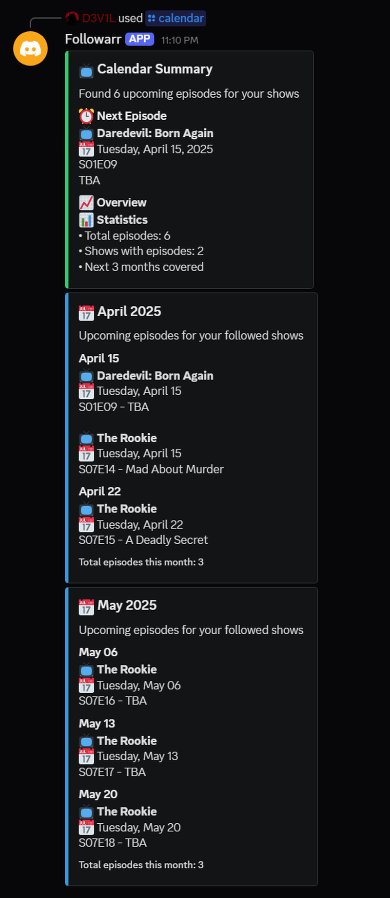
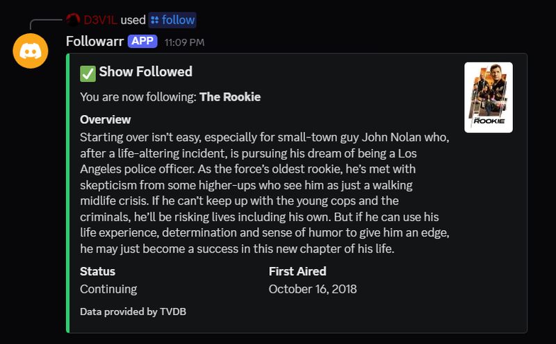
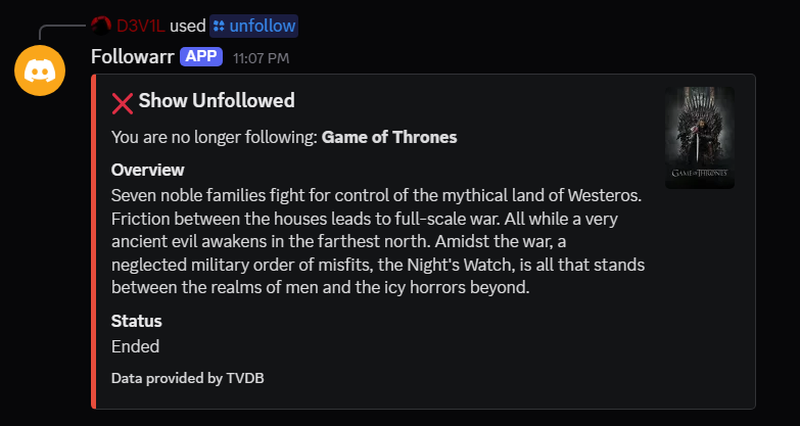
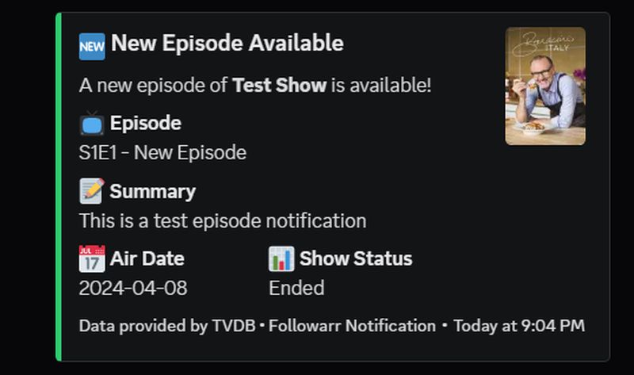

# 📺 Followarr

<div align="center">


A Discord bot that integrates with Tautulli to notify users about new episodes of their favorite TV shows.  
Get notifications when new episodes are added to your media server!

</div>

---

## ✨ Features

### Discord Commands
- 🔔 `/follow <show name>` - Follow a TV show to receive notifications
- 🚫 `/unfollow <show name>` - Unfollow a TV show
- 📋 `/list` - View all your followed shows
- 📅 `/calendar` - View upcoming episodes for your followed shows

### Notifications
Receive detailed Discord DMs when new episodes are available:
- Show title, episode info, and summary
- Season and episode numbers
- Air date and show poster
- Show status and timestamp

---

## 🚀 Getting Started

### Prerequisites

- Discord Bot Token
- TVDB API Key
- Tautulli instance with API access
- Docker and Docker Compose

### 🤖 Discord Bot Setup

1. Visit the [Discord Developer Portal](https://discord.com/developers/applications)
2. Create a "New Application" and add a bot
3. Enable required intents:
   ```
   ✓ MESSAGE CONTENT INTENT
   ✓ SERVER MEMBERS INTENT
   ```
4. Copy your bot token - you'll need it for the configuration

### 🐳 Docker Installation

1. Create a directory for Followarr and navigate to it:
   ```bash
   mkdir Followarr
   cd Followarr
   ```

2. Download the required files:
   ```bash
   # Download docker-compose.yml and .env.example
   curl -O https://raw.githubusercontent.com/d3v1l1989/Followarr/main/docker-compose.yml
   curl -O https://raw.githubusercontent.com/d3v1l1989/Followarr/main/.env.example
   
   # Download the installation script (optional, for guided setup)
   curl -O https://raw.githubusercontent.com/d3v1l1989/Followarr/main/install.sh  # For Linux/Mac
   # OR
   curl -O https://raw.githubusercontent.com/d3v1l1989/Followarr/main/install.ps1  # For Windows
   ```

3. Make the installation script executable (Linux/Mac only, if downloaded):
   ```bash
   chmod +x install.sh
   ```

4. Run the installation script:
   ```bash
   ./install.sh  # For Linux/Mac
   # OR
   .\install.ps1  # For Windows
   ```

5. Edit the `.env` file with your configuration:
   ```bash
   nano .env  # or use any text editor
   ```

6. Start the bot:
   ```bash
   docker compose up -d
   ```

   You can check the logs with:
   ```bash
   docker compose logs -f
   ```

### 🔧 Configuration

Edit the `.env` file with your settings:

```env
# Discord Bot Configuration
DISCORD_BOT_TOKEN=your_discord_bot_token
DISCORD_CHANNEL_ID=your_discord_channel_id

# TVDB API Configuration
TVDB_API_KEY=your_tvdb_api_key

# Tautulli Configuration
TAUTULLI_URL=http://your-tautulli-server:8181
TAUTULLI_API_KEY=your_tautulli_api_key

# Webhook Server Configuration
WEBHOOK_SERVER_PORT=3000

# Logging Configuration
LOG_LEVEL=INFO
```

### 🔄 Updating

To update to the latest version:

```bash
docker compose pull
docker compose up -d
```

### 🛑 Stopping the Bot

```bash
docker compose down
```

### 📝 Viewing Logs

```bash
docker compose logs -f
```

### 🔄 Restarting

After making changes to the `.env` file:

```bash
docker compose restart
```

---

## 🚀 Installation

Followarr is best installed using Docker and the official image from GitHub Container Registry (ghcr.io).

### Standard Docker Install (Recommended)

This method gives you the most control.

1.  **Create a Directory:**
    ```bash
    mkdir followarr
    cd followarr
    ```

2.  **Create `docker-compose.yml`:**
    Create a file named `docker-compose.yml` in the `followarr` directory and paste the following content:
    <details>
    <summary>Click to expand docker-compose.yml</summary>

    ```yaml
    version: '3.8'

    services:
      followarr:
        image: ghcr.io/d3v1l1989/followarr:edge
        container_name: followarr
        restart: unless-stopped
        environment:
          - TZ=${TZ:-UTC}
        env_file:
          - .env
        volumes:
          - ./data:/app/data
          - ./logs:/app/logs
        ports:
          - "${WEBHOOK_SERVER_PORT:-3000}:3000"
        user: "${UID:-1000}:${GID:-1000}"
        healthcheck:
          test: ["CMD", "curl", "-f", "http://localhost:${WEBHOOK_SERVER_PORT:-3000}/health"]
          interval: 30s
          timeout: 10s
          retries: 3
          start_period: 10s
        logging:
          driver: "json-file"
          options:
            max-size: "10m"
            max-file: "3"
        networks:
          - followarr-net

    networks:
      followarr-net:
        driver: bridge

    volumes:
      data:
        driver: local
      logs:
        driver: local
    ```
    </details>

3.  **Create and Configure `.env` File:**
    Create a file named `.env` in the `followarr` directory and paste the following content. **Then, edit this file with your actual settings (BOT TOKEN, TVDB KEY, etc.).**
    <details>
    <summary>Click to expand .env content</summary>

    ```env
    # Discord Bot Configuration
    DISCORD_BOT_TOKEN=YourDiscordBotToken
    DISCORD_CHANNEL_ID=YourDiscordChannelId

    # TVDB API Configuration
    TVDB_API_KEY=YourTVDBApiKey

    # Tautulli Configuration
    TAUTULLI_URL=http://your-tautulli-server:8181
    TAUTULLI_API_KEY=YourTautulliApiKey

    # Database Configuration
    DATABASE_URL=sqlite:///data/followarr.db

    # Webhook Server Configuration
    WEBHOOK_SERVER_PORT=3000

    # Logging Configuration
    LOG_LEVEL=INFO  # Options: DEBUG, INFO, WARNING, ERROR, CRITICAL

    # Docker Configuration
    TZ=UTC  # Set your timezone (e.g., Europe/Belgrade)
    UID=1000  # Your user ID (run 'id -u' to get it)
    GID=1000  # Your group ID (run 'id -g' to get it)
    ```
    </details>
    *This is a crucial step! Fill in all required variables.* 

4.  **Start Followarr:**
    ```bash
    docker compose up -d
    ```
    This will pull the `ghcr.io/d3v1l1989/followarr:edge` image (latest development build) and start the container.

5.  **(Optional) Use a Specific Version:** To use a stable release, edit `docker-compose.yml` (the file you created in Step 2) and change the image tag from `:edge` to a specific version, like `:v1.0.0`, before running `docker compose up -d`.

6.  **Check Logs:**
    ```bash
    docker compose logs -f
    ```

7.  **Updating:**
    ```bash
    # Pull the latest image (edge or the specific version in your compose file)
    docker compose pull
    
    # Restart the container with the new image
    docker compose up -d 
    ```

### Quick Install with Scripts (Optional)

These scripts automate the creation of the `docker-compose.yml` and `.env` files shown above. You will still need to manually edit the `.env` file with your specific settings.

#### Linux/macOS
```bash
# Create directory
mkdir followarr && cd followarr

# Download and run the installation script
curl -sSL https://raw.githubusercontent.com/d3v1l1989/Followarr/main/install.sh -o install.sh
chmod +x install.sh
./install.sh

# IMPORTANT: Edit the .env file created by the script!
nano .env

# Start the bot
docker compose up -d
```

#### Windows (using PowerShell)
```powershell
# Create directory
New-Item -ItemType Directory -Path ".\followarr"
Set-Location -Path ".\followarr"

# Download and run the installation script
Invoke-WebRequest -Uri "https://raw.githubusercontent.com/d3v1l1989/Followarr/main/install.ps1" -OutFile "install.ps1"
.\install.ps1

# IMPORTANT: Edit the .env file created by the script!
notepad .\.env

# Start the bot
docker compose up -d
```

## 🔧 Configuration

### Environment Variables

The bot requires several environment variables to be set in the `.env` file:

| Variable | Description | Required |
|----------|-------------|----------|
| `DISCORD_BOT_TOKEN` | Your Discord bot token | Yes |
| `DISCORD_CHANNEL_ID` | The Discord channel ID for notifications | Yes |
| `TVDB_API_KEY` | Your TVDB API key | Yes |
| `TAUTULLI_API_KEY` | Your Tautulli API key | Yes |
| `TAUTULLI_URL` | URL of your Tautulli instance | Yes |
| `DATABASE_URL` | SQLite database URL | No (defaults to `sqlite:///data/followarr.db`) |
| `WEBHOOK_SERVER_PORT` | Port for the webhook server | No (defaults to `3000`) |
| `TZ` | Your timezone | No (defaults to `UTC`) |
| `UID` | User ID for Docker | No (defaults to `1000`) |
| `GID` | Group ID for Docker | No (defaults to `1000`) |

### Tautulli Webhook Setup

1. In Tautulli Settings → Notification Agents:
2. Add new Webhook agent
3. Configure URL:
   ```
   Docker: http://followarr:3000/webhook/tautulli
   Local:  http://your-server-ip:3000/webhook/tautulli
   ```
4. Enable "Recently Added" notifications

### Docker Network Configuration

**Important**: Make sure Followarr is on the same Docker network as your Tautulli container. If Tautulli is running in Docker, add it to the same network:

```yaml
services:
  tautulli:
    networks:
      - followarr-net

networks:
  followarr-net:
    external: true
```

## 🤝 Support

- [GitHub Issues](https://github.com/d3v1l1989/Followarr/issues)

## 🔧 Troubleshooting

### Common Issues

1. **Bot not responding to commands**
   - Check if the bot is running (`docker compose ps` or check the process)
   - Verify the bot token is correct in your `.env` file
   - Ensure the bot has proper permissions in your Discord server

2. **Tautulli notifications not working**
   - Verify the webhook URL is correctly set in Tautulli
   - Check if the webhook server is accessible (port 8000)
   - Ensure the Tautulli API key is correct

3. **TV Show information not updating**
   - Check if the TVDB API key is valid
   - Verify the show exists in TVDB
   - Check the logs for any API errors

### Logging

Followarr uses different log levels:
- `INFO`: General operational information
- `WARNING`: Non-critical issues that don't affect functionality
- `ERROR`: Critical issues that need attention

You can adjust the log level by setting the `LOG_LEVEL` environment variable:
```bash
LOG_LEVEL=INFO  # Default, shows all logs
LOG_LEVEL=WARNING  # Shows only warnings and errors
LOG_LEVEL=ERROR  # Shows only errors
```

## 📝 License

This project is licensed under the MIT License - see the [LICENSE](LICENSE) file for details.

## Screenshots

Here are some screenshots of the bot in action:

### Calendar Command


_View upcoming episodes for your followed shows_

### Follow Command


_Follow a new TV show_

### Unfollow Command


_Unfollow a TV show_

### List Command


_View all your followed shows_

### Episode Notification


_Receive notifications for new episodes_

## 👨‍💻 Development

### 🚀 Release Process (for Maintainers)

Followarr uses GitHub Actions to automatically build and publish Docker images to GitHub Container Registry (ghcr.io).

1. **Push to `main` branch:** Automatically builds and pushes the `ghcr.io/d3v1l1989/followarr:edge` image.
2. **Create and push a Git tag (e.g., `v1.0.1`):**
   ```bash
   git tag -a v1.0.1 -m "Release v1.0.1"
   git push origin v1.0.1
   ```
   This automatically builds and pushes the versioned image `ghcr.io/d3v1l1989/followarr:v1.0.1`.

Users can pull specific versions by changing the image tag in their `docker-compose.yml` (e.g., `ghcr.io/d3v1l1989/followarr:v1.0.1`).

### 🔄 Versioning

Followarr uses semantic versioning (MAJOR.MINOR.PATCH):
- MAJOR: Breaking changes
- MINOR: New features, backward compatible
- PATCH: Bug fixes, backward compatible

## ☕ Support the Project

If you find Followarr useful and would like to support its development, you can buy me a coffee at [ko-fi.com/d3v1l1989](https://ko-fi.com/d3v1l1989). Your support helps keep the project maintained and free for everyone!