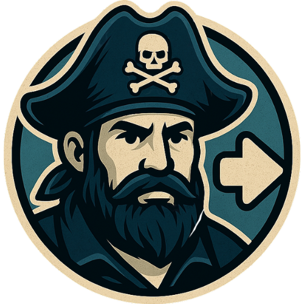

# 📺 Followarr

<div align="center">



A Discord bot that integrates with Plex to notify users about new episodes of their favorite TV shows.  
Get notifications when new episodes are added to your media server!

</div>

---

## ✨ Features

### Discord Commands
- 🔔 `/follow <show name>` - Follow a TV show to receive notifications
- 🚫 `/unfollow <show name>` - Unfollow a TV show
- 📋 `/list` - View all your followed shows
- 📅 `/calendar` - View upcoming episodes for your followed shows

### Notifications
Receive detailed Discord DMs when new episodes are available:
- Show title, episode info, and summary
- Season and episode numbers
- Air date and show poster
- Show status and timestamp

---

## 🚀 Getting Started

This section guides you through setting up Followarr.

### Prerequisites

- Discord Bot Token (See setup below)
- TVDB API Key ([Get one here](https://thetvdb.com/subscribe))
- Plex Media Server with Plex Pass (required for webhooks)
- Docker and Docker Compose installed

### 🤖 Discord Bot Setup

1.  Visit the [Discord Developer Portal](https://discord.com/developers/applications).
2.  Create a "New Application" and give it a name (e.g., Followarr).
3.  Navigate to the "Bot" tab.
4.  Click "Add Bot" and confirm.
5.  **Enable Required Intents:**
    *   Under "Privileged Gateway Intents", enable:
        *   `MESSAGE CONTENT INTENT`
        *   `SERVER MEMBERS INTENT` (May be needed depending on future features or specific server setups)
6.  **Copy Your Bot Token:** Click "Reset Token" (and confirm) to view and copy your bot token. **Treat this like a password!** You'll need it for the `.env` configuration.
7.  **Invite the Bot:** Go to the "OAuth2" -> "URL Generator" tab.
    *   Select the `bot` and `applications.commands` scopes.
    *   Under "Bot Permissions", select:
        *   `Send Messages`
        *   `Embed Links`
        *   `Read Message History` (To process commands)
    *   Copy the generated URL and paste it into your browser to invite the bot to your server.

### 🐳 Docker Installation

Followarr is best installed using Docker and the official image from GitHub Container Registry (ghcr.io).

This is the recommended method to install Followarr.

1.  **Create a Directory:**
    ```bash
    mkdir followarr
    cd followarr
    ```

2.  **Create `docker-compose.yml`:**
    Create a file named `docker-compose.yml` in the `followarr` directory and paste the following content:

    ```yaml
    services:
      followarr:
        image: ghcr.io/d3v1l1989/followarr:edge # Use :edge for latest dev, or a version tag like :v1.0.0
        container_name: followarr
        restart: unless-stopped
        environment:
          - TZ=${TZ:-UTC}
        env_file:
          - .env
        volumes:
          # Use bind mounts for persistent storage
          - ./data:/app/data # Stores database
          - ./logs:/app/logs # Stores log files
        ports:
          # Exposes the webhook port (default 3000)
          - "${WEBHOOK_SERVER_PORT:-3000}:3000" 
        # Optional: Run as a specific user/group
        user: "${UID:-1000}:${GID:-1000}" 
        healthcheck:
          # Checks if the webhook server is responsive
          test: ["CMD", "curl", "-f", "http://localhost:${WEBHOOK_SERVER_PORT:-3000}/health"]
          interval: 30s
          timeout: 10s
          retries: 3
          start_period: 10s
        logging:
          # Configure Docker log rotation
          driver: "json-file"
          options:
            max-size: "10m"
            max-file: "3"
        networks:
          - followarr-net # Connect to the dedicated network

    networks:
      followarr-net:
        driver: bridge # Default bridge network
    ```

3.  **Set Up Volume Permissions:**
    Before starting the container, ensure the data and logs directories have the correct permissions:
    ```bash
    # Create directories if they don't exist
    mkdir -p data logs

    # Set ownership to match the UID:GID in your .env file (default 1000:1000)
    chown -R 1000:1000 data logs

    # Set directory permissions
    chmod 755 data logs
    ```
    This ensures the container user has proper permissions to write to the mounted volumes.

4.  **Create and Configure `.env` File:**
    Create a file named `.env` in the `followarr` directory and paste the following content. **Then, edit this file with your actual settings (BOT TOKEN, TVDB KEY, etc.).**

    ```env
    # Discord Bot Configuration
    DISCORD_BOT_TOKEN=YourDiscordBotToken
    DISCORD_CHANNEL_ID=YourDiscordChannelId # Channel ID where bot might post updates (future use)

    # TVDB API Configuration
    TVDB_API_KEY=YourTVDBApiKey

    # Plex Configuration
    PLEX_URL=http://your-plex-server:32400 # URL to access Plex
    PLEX_TOKEN=YourPlexToken # Your Plex token (get this from your Plex account)

    # Database Configuration (uses SQLite by default)
    DATABASE_URL=sqlite:///data/followarr.db

    # Webhook Server Configuration
    WEBHOOK_SERVER_PORT=3000 # Port the internal webhook server listens on

    # Logging Configuration
    LOG_LEVEL=INFO  # Options: DEBUG, INFO, WARNING, ERROR, CRITICAL

    # Docker Configuration
    TZ=UTC  # Set your timezone (e.g., Europe/Belgrade)
    UID=1000  # Your user ID on the host (run 'id -u')
    GID=1000  # Your group ID on the host (run 'id -g')
    ```
    *This is a crucial step! Fill in all required variables.* 

5.  **Start Followarr:**
    ```bash
    docker compose up -d
    ```
    This will pull the `ghcr.io/d3v1l1989/followarr:edge` image (latest development build) and start the container.

6.  **(Optional) Use a Specific Version:** To use a stable release, edit `docker-compose.yml` (the file you created in Step 2) and change the image tag from `:edge` to a specific version, like `:v1.0.0`, before running `docker compose up -d`.

### ⚙️ Post-Installation Configuration

*   **Database & Logs:** Followarr uses bind mounts to store the database and logs in the `data` and `logs` directories respectively. These directories are mounted from your host system and will persist even if the container is removed or restarted.
*   **Plex Webhook:** Configure Plex to send webhook notifications to Followarr for new episodes (see details below).

#### Plex Webhook Setup

1.  **Access Plex Web Interface:**
    - Open your Plex Media Server web interface (typically at `http://your-plex-server:32400/web`)
    - Log in with your Plex account (must be a Plex Pass subscriber)

2.  **Navigate to Settings:**
    - Click the wrench icon (⚙️) in the top right corner
    - Select "Settings" from the dropdown menu

3.  **Add Webhook:**
    - In the left sidebar, click on "Webhooks" under "Settings"
    - Click the "Add Webhook" button
    - Enter your Followarr webhook URL:
      - Same Docker network: `http://followarr:3000/webhook/plex`
      - Different machines: `http://<followarr_ip>:3000/webhook/plex`
        (replace `<followarr_ip>` with your Followarr server's IP)

4.  **Save and Test:**
    - Click "Save Changes" to create the webhook
    - Test by adding a new TV show episode to your Plex library
    - You should receive a Discord notification if everything is set up correctly

**Important Notes:**
- Plex webhooks require an active Plex Pass subscription
- Followarr automatically filters webhook events and only processes `library.new` events for new episodes
- Ensure your Followarr instance is accessible from your Plex server

#### Docker Network (If Plex is also in Docker)

For Plex to reach Followarr using the `http://followarr:3000` URL, both containers must be on the same custom Docker network. Ensure your Plex `docker-compose.yml` connects it to the `followarr-net` network defined in Followarr's `docker-compose.yml`.

Example snippet for Plex's `docker-compose.yml`:
```yaml
services:
  plex:
    # ... other Plex config ...
    networks:
      - followarr-net # Add this line
      # - other_networks...

networks:
  followarr-net:
    external: true # Connect to the existing network created by Followarr
  # other_networks: ...
```
*Remember to restart Plex after modifying its compose file.* 

*   **Restart Followarr (e.g., after `.env` changes):**
    ```bash
    # Navigate to your followarr directory
    docker compose restart followarr
    ```
*   **View Volume Data (Advanced):** You can inspect the data stored in the bind mounts using standard file system commands since they are stored directly on your host system.

## 🔧 Advanced Configuration

### Environment Variables

The bot requires several environment variables to be set in the `.env` file:

| Variable              | Description                                       | Required | Default Value                    |
|-----------------------|---------------------------------------------------|----------|----------------------------------|
| `DISCORD_BOT_TOKEN`   | Your Discord bot token                            | Yes      | -                                |
| `DISCORD_CHANNEL_ID`  | Discord channel ID for potential future updates   | Yes      | -                                |
| `TVDB_API_KEY`        | Your TVDB API key                                 | Yes      | -                                |
| `PLEX_TOKEN`          | Your Plex token                                   | Yes      | -                                |
| `PLEX_URL`            | URL of your Plex server                           | Yes      | -                                |
| `DATABASE_URL`        | SQLite database URL                               | No       | `sqlite:///data/followarr.db`  |
| `WEBHOOK_SERVER_PORT` | Internal port for the webhook server              | No       | `3000`                           |
| `LOG_LEVEL`           | Logging level (DEBUG, INFO, WARNING, ERROR, CRITICAL) | No | `INFO` |
| `TZ`                  | Your timezone (e.g., `Europe/Belgrade`)             | No       | `UTC`                            |
| `UID`                 | User ID for Docker container process              | No       | `1000`                           |
| `GID`                 | Group ID for Docker container process             | No       | `1000`                           |

## 🤝 Support

- [GitHub Issues](https://github.com/d3v1l1989/Followarr/issues)

## Screenshots

Here are some screenshots of the bot in action:

### Calendar Command
[Calendar Command](docs/screenshots/calendar.png)

_View upcoming episodes for your followed shows_

### Follow Command
[Follow Command](docs/screenshots/follow.png)

_Follow a new TV show_

### Unfollow Command
[Unfollow Command](docs/screenshots/unfollow.png)

_Unfollow a TV show_

### List Command
[List Command](docs/screenshots/list.png)

_View all your followed shows_

### Episode Notification
[Episode Notification](docs/screenshots/notification.png)

_Receive notifications for new episodes_

## 👨‍💻 Development

## 📸 Image Credits

- Followarr logo by PuksThePirate

## ☕ Support the Project

If you find Followarr useful and would like to support its development, you can buy me a coffee at [ko-fi.com/d3v1l1989](https://ko-fi.com/d3v1l1989). Your support helps keep the project maintained and free for everyone!

## 📝 License

This project is licensed under the MIT License - see the [LICENSE](LICENSE) file for details.